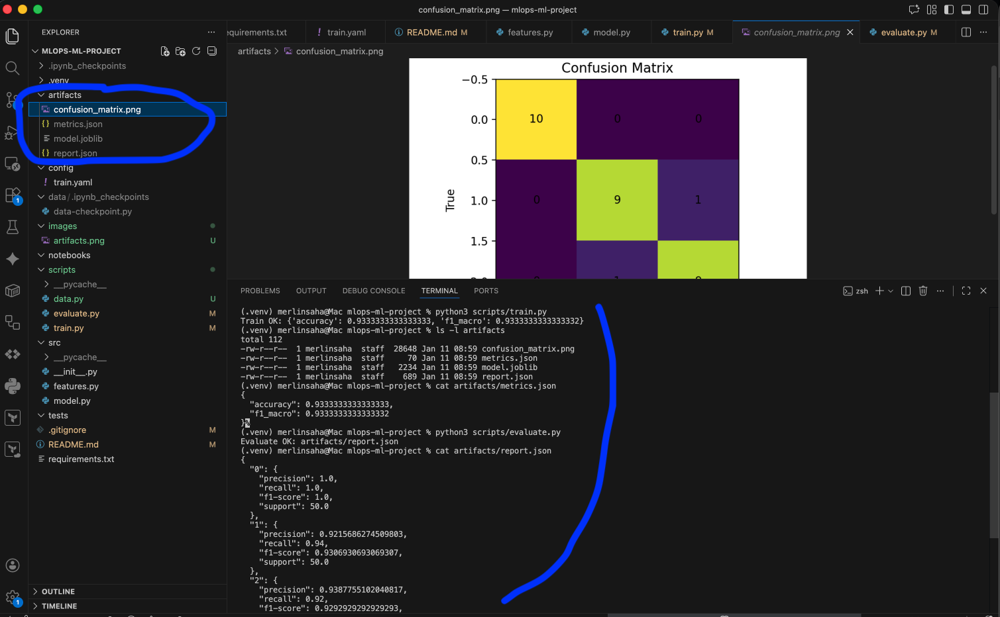

# ML Project for MLOps

## Installation
```shell
python3 -m venv .venv
source .venv/bin/activate

touch .gitignore
vi .gitignore 

pip install -r requirements.txt
jupyter lab 

```

## Entraînement
```shell
python3 scripts/train.py
```

## Évaluation
```shell
python3 scripts/evaluate.py
```

## Liste des artifacts

- artifacts/model.joblib
- artifacts/metrics.json
- artifacts/confusion_matrix.png
- artifacts/report.json


## Commandes
```shell

git init
git add .gitignore 
git commit -m "Create .gitignore file"
git log

git status
git add .
git commit -m "feat: add train, evaluate and config files"

git branch -M main
git remote add origin https://github.com/devsahamerlin/mlops-ml-project.git

git push -u origin main

git checkout -b dev
git push --set-upstream origin dev

git checkout -b feature/preprocessing
git add README.md
git commit -m "docs: add installation and git command in README file"

git checkout -b feature/evolutions

git add .
git commit -m "core: structure et installation des dépendances"

export PYTHONPATH="${PYTHONPATH}:$(pwd)"

python3 scripts/train.py
ls -l artifacts
cat artifacts/metrics.json
python3 scripts/evaluate.py

cat artifacts/report.json
```



